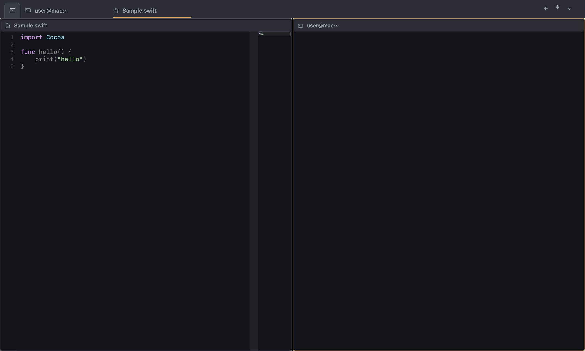

<p align="center">
  
</p>

<h1 align="center">Suit</h1>

<p align="center">
  <strong>Stop Using IDE Terminal.</strong><br>
  A native macOS terminal that's growing into a Claude-code-first cockpit for codebase work.
</p>

<p align="center">
  <a href="https://github.com/ivibedathing/suit/actions/workflows/swift.yml"></a>
  
  
  
  
</p>

<p align="center">
  
</p>

Suit is a personal macOS app bundle — its own Dock icon, bundle identifier and TCC permission
entries — whose windows host browser-style tabs of terminals, file viewers, diffs and Claude
transcripts. Each shell runs directly over a real pty via
[SwiftTerm](https://github.com/migueldeicaza/SwiftTerm), and everything above the terminal (tabs,
splits, search, git, Claude session awareness, Autopilot) is native AppKit — built to make
Claude-code-driven work on any codebase feel like a first-class desktop app rather than a wall
of terminal panes.

## Table of contents

- [Why Suit](#why-suit)
- [Highlights](#highlights)
- [Features](#features)
- [Keyboard shortcuts](#keyboard-shortcuts)
- [Install & build](#install--build)
- [Requirements](#requirements)
- [Project layout](#project-layout)
- [Contributing](#contributing)
- [License](#license)

## Why Suit

Working in a large codebase with Claude Code means juggling many terminals, files, diffs and running
sessions at once — and a plain terminal emulator makes you track all of it in your head. Suit puts
a native cockpit around that workflow: browser-style tabs and splits, an integrated file
viewer / search / git sidebar, awareness of which panes have live Claude sessions (and which need
your input), and an Autopilot that can grind through a `ROADMAP.md` on its own. It stays a real
terminal underneath — login shells, your prompt, your dotfiles — so nothing you already do stops
working.

## Highlights

- **Browser-style tabs & splits** for terminals, files, diffs and transcripts, with full state
  restoration across launches.
- **Integrated sidebar** — file tree, ripgrep search, git status / branches / PRs, blame, file
  history, notes and bookmarks — kept gitignore-consistent with a live file index.
- **Claude Code awareness** — per-pane session state and context %, attention notifications,
  talk-back into any session, live transcripts and cross-transcript search.
- **Autopilot** — autonomous, budget-aware execution of a project's roadmap with build and
  headless-review gates before it auto-merges each phase.
- **Native and honest** — one signed app bundle, real ptys, login + interactive shells, and
  passwords kept only in the macOS Keychain.

## Features

Suit has grown a broad feature set — browser-style tabs & panes, an integrated file/search/git
sidebar, a full Claude Code cockpit, Autopilot, theming, glassmorphism, and more. To keep this
README readable, the complete, detailed feature reference now lives in
**[docs/features.md](docs/features.md)**:

- [Tabs & panes — the browser model](docs/features.md#tabs--panes--tabs-live-on-the-pane)
- [Files, search & navigation](docs/features.md#files-search--navigation)
- [Claude Code cockpit](docs/features.md#claude-code-cockpit)
- [Autopilot](docs/features.md#autopilot)
- [Appearance & settings](docs/features.md#appearance--settings)
- [Glassmorphism (transparency & blur)](docs/features.md#glassmorphism-transparency--blur)
- [Themes](docs/features.md#themes)
- [Safety](docs/features.md#safety)

The [Highlights](#highlights) above are the short version.

## Keyboard shortcuts

The full list also lives in-app under **Settings (⌘,) ▸ Shortcuts**.

<details>
<summary><strong>Show all shortcuts</strong></summary>

### Tabs

| Shortcut | Action |
| --- | --- |
| ⌘T | New tab |
| ⌘W | Close tab |
| ⇧⌘T | Reopen closed tab |
| ⇧⌘] | Next tab |
| ⇧⌘[ | Previous tab |
| ⌃Tab | Cycle recent tabs (MRU) |
| ⌃⇧Tab | Cycle recent tabs (back) |
| ⌘1…⌘8 | Go to tab 1–8 |
| ⌘9 | Go to last tab |

### Screens & splits

| Shortcut | Action |
| --- | --- |
| ⌘D | Split screen with new terminal |
| ⇧⌘D | Split screen horizontally (stacked) |
| ⌥⌘W | Unsplit (keep tab) |
| ⌃⌘M | Unsplit all |
| ⌥⌘← / → / ↑ / ↓ | Focus split left / right / above / below |

Save and reopen named window layouts from the Screen menu (**Save Layout As…** / **Open Layout…**)
or the command palette (which also offers **Rename Layout…** and **Delete Layout…**).

### Files, search & navigation

| Shortcut | Action |
| --- | --- |
| ⌘P | Open quickly (fuzzy file finder) |
| ⌘K | Command palette |
| ⌃R | Search command history (Enter runs · ⇧Enter edits first) |
| ⌘B | Toggle sidebar |
| ⇧⌘F | Search in project |
| ⌘F | Find in pane |
| ⌘G | Find next |
| ⇧⌘G | Find previous |
| ⌘E | Use selection for find |
| ⌘S | Save the edited file (file viewer) |
| ⌘L | Go to line (file viewer) |
| ⇧⌘L | Toggle bookmark on the current line (file viewer) |
| ⌃⌘J | Go to definition (file viewer; also Cmd-click) |
| ⌃⌘R | Find references (file viewer) |

### Git & Claude

| Shortcut | Action |
| --- | --- |
| ⌃⌘D | Show git diff |
| ⌃⌘B | Toggle blame gutter (file viewer) |
| ⌃⌘H | Time travel through the file's history (file viewer) |
| ⌃⌘C | New Claude session |
| ⌃⌘T | New Claude task |
| ⌃⌘F | Search transcripts |
| ⌃⌘/ | Slash-command menu |
| ⌃⌘K | Compact focused session (/compact) |
| ⇧⌘O | Show fleet dashboard |

Show File History (palette / viewer right-click) lists the open file's commits in the Git tab.

In a focused diff pane, `n` / `p` walk the changed files, `o` opens the file under review, and
`c` adds a review comment on the line at the caret (batched to a Claude session with Send
Review to Session…).

The Git tab's Feedback section (CI failures / PR review comments / merge conflicts) routes each
item to its originating Claude session — click a row or use the palette's **Show Feedback Inbox**
and **Route Feedback to Session…**.

The Git tab's PR Review Inbox lists open PRs that involve you; click one (or **Show PR Review
Inbox**) to review its diff, then **Submit as PR Review…** posts an Approve / Request Changes /
Comment verdict via `gh pr review`.

### Appearance

| Shortcut | Action |
| --- | --- |
| ⌘= / ⌘- | Increase / decrease font size |
| ⇧⌘= / ⇧⌘- | Increase / decrease font size (all panes) |
| ⌘] / ⌘[ | Increase / decrease opacity |
| ⇧⌘B | Toggle background blur |

### App & windows

| Shortcut | Action |
| --- | --- |
| ⌘N | New window |
| ⌘, | Settings |
| ⌘C / ⌘V | Copy / paste |
| ⌘Q | Quit Suit |

</details>

## Install & build

There is no Xcode project and no SwiftPM package — Suit is compiled directly with `swiftc` and
assembled into an app bundle by `build.sh` (see [Requirements](#requirements) and the "Why no
SwiftPM" note in `CLAUDE.md` for the reasoning).

```sh
git clone https://github.com/<your-org>/suit.git
cd suit
./build.sh                 # builds swift/, assembles build/Suit.app (ad-hoc code signed)
open build/Suit.app        # launch like a normal Mac app
```

To iterate on the UI without assembling the bundle, compile the Swift sources straight to a binary:

```sh
swiftc -O swift/Sources/suit/*.swift \
  $(find swift/Vendor/SwiftTerm -name '*.swift') -o /tmp/suit-shell && /tmp/suit-shell
```

There is no XCTest target; the pure, UI-free logic is covered by standalone harnesses. Run them
all with `scripts/test.sh` (fast suite) or `scripts/test.sh --all` (includes the ~4-minute
Autopilot pipeline harness) — see the "Testing" section in `CLAUDE.md`.

Two integrations are wired up from inside the app rather than by hand:

- **Claude Code integration** — app menu ▸ *Install Claude Code Integration…* copies the
  bundled statusline / hook scripts to `~/.suit` and merges them into `~/.claude/settings.json`
  (a one-time backup is written first). Required for session awareness and Autopilot.
- **GitHub CLI (`gh`)** — needed for the Branch → PR actions and Autopilot's PR flow.
  Everything degrades gracefully when it's missing.

## Requirements

- **macOS 14+**
- **Xcode Command Line Tools** (`swiftc`) — no full Xcode or SwiftPM required
- **`gh`** (optional) — for PR creation and Autopilot
- **Claude Code** (optional) — for the Claude cockpit features and Autopilot

## Project layout

| Path | What lives there |
| --- | --- |
| `swift/Sources/suit/` | The AppKit app — UI, tabs, sidebar, git / Claude / Autopilot logic |
| `swift/Vendor/SwiftTerm/` | Vendored SwiftTerm source (no SPM — see `CLAUDE.md`) |
| `scripts/claude/` | Statusline + session-state hook scripts installed into `~/.suit` |
| `scripts/test.sh` | Runs the standalone logic harnesses (`*-test.sh` / `*-harness.sh`) |
| `design/` | App icon and the committed reference render used to catch visual drift |
| `docs/` | Long-form docs — `features.md` is the full feature reference |
| `Resources/Info.plist` | App bundle metadata and permission usage strings |
| `build.sh` | Builds everything and assembles `build/Suit.app` |
| `AGENTS.md` | Concise front-door for coding agents (60-second orientation) |
| `.claude/commands/` | Repo slash commands: `/build`, `/test`, `/find-file`, `/orient`, … |
| `CLAUDE.md` | Full architecture breakdown and contributor guidance |

## Contributing

This is a personal project, but the workflow is documented if you want to hack on it:

- Read `AGENTS.md` for the 60-second orientation, then `CLAUDE.md` for the full architecture, the
  dev loop, and why the build avoids SwiftPM.
- Start each change on its own branch in its own git worktree — never work directly in the main
  checkout — so concurrent Claude Code sessions don't step on each other's edits.
- Run `scripts/test.sh` before committing non-UI changes, and regenerate the reference render
  (`design/render-reference.sh`) after chrome edits.
- After implementing a feature, document the user-facing behavior (shortcuts, settings) in
  [`docs/features.md`](docs/features.md) so it stays a current description of what the app does.
  Keep this README lean — update it only when the change belongs in Highlights or the shortcuts
  table.

## License

Suit is released under the [MIT License](LICENSE) — © 2026 ivibedathing. You're free to use, copy,
modify, and distribute it, provided the copyright notice and permission notice are kept.
