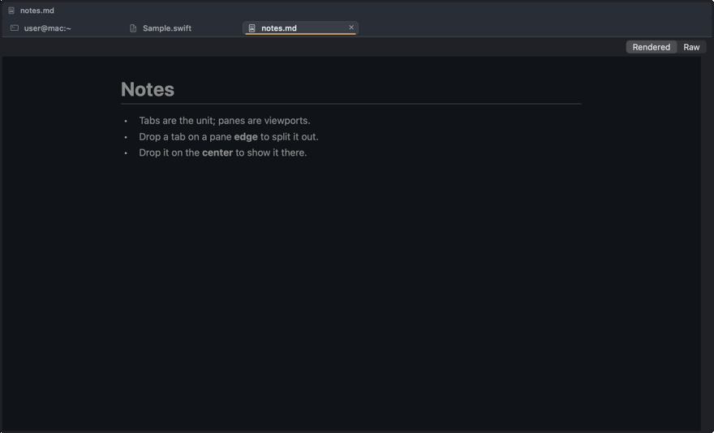

<p align="center">
  
</p>

<h1 align="center">Suit</h1>

<p align="center">
  <strong>Stop Using IDE Terminal.</strong><br>
  A native macOS terminal that becomes a control center for your work on a codebase.
</p>

<p align="center">
  <a href="https://github.com/ivibedathing/suit/actions/workflows/swift.yml"></a>
  
  
  
  
</p>

<p align="center">
  
  <br>
  <em>Tabs in motion. Drag a tab to the <strong>edge</strong> of a pane to make a new pane for it. Drag it to the <strong>center</strong> to show it in that pane. The area with the highlight shows you where the tab goes.</em>
</p>

Suit is a personal macOS app bundle. It has its own Dock icon, its own bundle identifier and its
own TCC permissions. Each window shows tabs in the style of a web browser: terminals, file viewers,
diffs and Claude transcripts. Each shell operates directly on a true pty through
[SwiftTerm](https://github.com/migueldeicaza/SwiftTerm). All the parts above the terminal are
native AppKit: the tabs, the splits, the search, the git functions and the data about the Claude
sessions. Thus work with Claude Code on a codebase feels like a true desktop app, and not like many
terminal panes together.

## Table of contents

- [Why Suit](#why-suit)
- [Highlights](#highlights)
- [Features](#features)
- [Keyboard shortcuts](#keyboard-shortcuts)
- [Install & build](#install--build)
- [Requirements](#requirements)
- [Development and contribution](#development-and-contribution)
- [License](#license)

## Why Suit

When you work in a large codebase with Claude Code, you use many terminals, files, diffs and
sessions at the same time. With a usual terminal emulator, you must remember all of them yourself.
Suit puts a native control center around that work. It gives you tabs and splits in the style of a
web browser. It gives you a sidebar with a file viewer, a search function and the git functions. It
also shows you which panes have a live Claude session, and which sessions need your answer. Below
all of this, Suit stays a true terminal, with login shells, your prompt and your dotfiles. Thus
your usual procedures continue to operate.

## Highlights

- **Tabs and splits in the style of a web browser** for terminals, files, diffs and transcripts.
  The app keeps the full state and puts it back at the next launch.
- **A sidebar with all the tools** — a tree of the files, a search with ripgrep, and a replace
  function for the full project on its own tab. A Source Control tab gives you the stage function,
  the commits, fetch, pull, push, the branches, the worktrees and the pull requests. There is also
  blame, the history of a file, notes and bookmarks. A live index of the files keeps all of this in
  agreement with your gitignore rules.
- **Data about Claude Code** — the state of the session and the percentage of the context for each
  pane, notifications when a session needs you, an answer function into each session, live
  transcripts, and a search through all the transcripts.
- **Native and honest** — one signed app bundle, true ptys, login shells and interactive shells.
  A password stays only in the macOS Keychain. The bundle contains
  [Hack](https://sourcefoundry.org/hack) and uses it by default. Thus a new installation looks
  correct immediately, and you install no other component first.

## Features

Suit has many functions: tabs and panes in the style of a web browser, a sidebar with the files,
the search and the git functions, a full control center for Claude Code, themes, and more. To keep
this README short, **[docs/features.md](docs/features.md)** gives the full reference:

- [Tabs & panes — the browser model](docs/features.md#tabs--panes--tabs-live-on-the-pane)
- [Files, search & navigation](docs/features.md#files-search--navigation)
- [Claude Code cockpit](docs/features.md#claude-code-cockpit)
- [Appearance & settings](docs/features.md#appearance--settings)
- [Themes](docs/features.md#themes)
- [Safety](docs/features.md#safety)

The [Highlights](#highlights) above are the short version.

## Keyboard shortcuts

The app also shows the full list in **Settings (⌘,) ▸ Shortcuts**.

<details>
<summary><strong>Show all shortcuts</strong></summary>

### Tabs

| Shortcut | Action |
| --- | --- |
| ⌘T | New tab |
| ⌘W | Close the tab |
| ⇧⌘T | Open the last closed tab again |
| ⇧⌘] | Next tab |
| ⇧⌘[ | Previous tab |
| ⌃Tab | Go through the recent tabs |
| ⌃⇧Tab | Go through the recent tabs, in the opposite sequence |
| ⌘1…⌘8 | Go to tab 1 to tab 8 |
| ⌘9 | Go to the last tab |

### Screens & splits

| Shortcut | Action |
| --- | --- |
| ⌘D | Split the screen and put a new terminal in the new pane |
| ⇧⌘D | Split the screen horizontally (one pane above the other) |
| ⌥⌘W | Remove the split, but keep the tab |
| ⌃⌘M | Remove all the splits |
| ⌥⌘← / → / ↑ / ↓ | Move the focus to the pane at the left, the right, above or below |

You can keep the layout of a window with a name, and open it again. Use the Screen menu
(**Save Layout As…** and **Open Layout…**). The command palette does the same, and also gives you
**Rename Layout…** and **Delete Layout…**.

### Files, search & navigation

| Shortcut | Action |
| --- | --- |
| ⌘P | Open a file quickly (a fuzzy search of the names) |
| ⌘K | Command palette |
| ⌃R | Search the history of the commands (Enter runs · ⇧Enter edits first) |
| ⌘B | Show or hide the sidebar |
| ⇧⌘F | Search in the project |
| ⌘F | Find in the pane |
| ⌥⌘F | Find and replace (file viewer) |
| ⌘G | Find the next result |
| ⇧⌘G | Find the previous result |
| ⌘E | Use the selection for the find function |
| ⌘Z / ⇧⌘Z | Undo / redo |
| ⌘X / ⌘C / ⌘V | Cut / copy / paste |
| ⌘A | Select all |
| Home / End | Go to the start / end of the line (⇧ extends the selection, ⌘ goes to the ends of the file) |
| ⌘S | Save the file that you edited (file viewer) |
| ⌘L | Go to a line (file viewer) |
| ⇧⌘L | Add or remove a bookmark on this line (file viewer) |
| ⌃⌘J | Go to the definition (file viewer; a click with ⌘ does the same) |
| ⌥⌘J | Show the definition in the same pane (file viewer; a click with ⌥⌘ does the same) |
| ⌃⌘R | Find the references (file viewer) |
| ⌃⌘O | Go to a symbol in this file (file viewer) |
| ⌃- / ⌃⇧- | Go back / forward through your jumps |
| ⌘/ | Add or remove a comment (file viewer) |
| ⌃⌘] / ⌃⌘[ | Increase / decrease the indent (file viewer) |
| ⌃⌘E / ⌃⌘G | Select the next / all the occurrences (multi-selection) |
| ⌥⌘[ / ⌥⌘] | Fold / unfold the block (file viewer) |
| ⌥⌘0 / ⇧⌥⌘0 | Fold / unfold all the blocks (file viewer) |

### Git & Claude

| Shortcut | Action |
| --- | --- |
| ⌃⌘G | Show Source Control (⌘↩ in the message box makes the commit) |
| ⌃⌘D | Show the git diff |
| ⌃⌘B | Show or hide the blame gutter (file viewer) |
| ⌃⌘H | Move through the history of the file (file viewer) |
| ⌃⌘C | New Claude session |
| ⌃⌘T | New Claude task |
| ⌃⌘F | Search the transcripts |
| ⌃⌘/ | Menu of the slash commands |
| ⌃⌘K | Compact the focused session (/compact) |
| ⇧⌘O | Show the fleet dashboard |

**Show File History** (in the palette, or with a click of the right button in the viewer) shows the
commits of the open file in the Source Control tab.

In a diff pane with the focus, `n` and `p` move to the changed files. `o` opens the file that you
review. `c` adds a comment for review on the line at the caret. The app collects these comments and
sends them to a Claude session with **Send Review to Session…**.

The Feedback section of the Source Control tab shows the failures of the CI, the review comments on
the pull requests, and the merge conflicts. It sends each item to the Claude session that caused
it. Click a row, or use **Show Feedback Inbox** and **Route Feedback to Session…** in the palette.

The PR Review Inbox of the Source Control tab shows the open pull requests that include you. Click
one, or use **Show PR Review Inbox**, to review its diff. Then **Submit as PR Review…** sends an
Approve, a Request Changes or a Comment result with `gh pr review`.

### Appearance

| Shortcut | Action |
| --- | --- |
| ⌘= / ⌘- | Increase / decrease the size of the font |
| ⇧⌘= / ⇧⌘- | Increase / decrease the size of the font (all the panes) |

### App & windows

| Shortcut | Action |
| --- | --- |
| ⌘N | New window |
| ⌘, | Settings |
| ⌘C / ⌘V | Copy / paste |
| ⌘Q | Quit Suit |

</details>

## Install & build

```sh
git clone https://github.com/ivibedathing/suit.git
cd suit
./build.sh                 # builds swift/, assembles build/Suit.app (ad-hoc code signed)
open build/Suit.app        # launch like a normal Mac app
```

There is no Xcode project and no SwiftPM package. `build.sh` compiles all the code directly with
`swiftc`, and then it assembles the bundle. **[docs/development.md](docs/development.md)** gives you
the development loop, the tests, the setup of the integrations, and the layout of the project.

## Requirements

- **macOS 14+**
- **Xcode Command Line Tools** (`swiftc`) — you do not need the full Xcode or SwiftPM
- **`gh`** (optional) — to make a pull request, and for the pull-request actions of the Source
  Control tab
- **Claude Code** (optional) — for the Claude functions

## Development and contribution

This is a personal project, but the procedures are in the documents. If you want to change the
code, start with **[docs/development.md](docs/development.md)**. It gives you the build loop, the
development loop, the tests, the setup of the integrations, the layout of the project, and the
procedure to contribute. `CLAUDE.md` gives you the architecture and the rules for the agents. This
document and `CLAUDE.md` use ASD-STE100, Simplified Technical English.

## License

Suit has the [MIT License](LICENSE) — © 2026 ivibedathing. You can use, copy, change and distribute
the app. You must keep the notice of the copyright and the notice of the permission.
